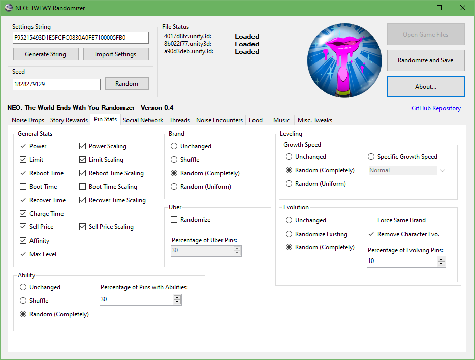

# NEO-TWEWY-Randomizer
This is a Randomizer for NEO: The World Ends With You.

 

The most recent version can be downloaded from the releases page. Supported features are described further down.

## Platform Support
The Randomizer now supports the PC version of the game! That version specifically encrypts the Unity asset bundles, which is what is modified by the randomizer. If a bundle is encrypted, the randomizer will now detect it and decrypt it properly before randomizing. The randomized bundle is then re-encrypted so it can be read by the game.

With the PC version now being supported, all versions of the game _should_ be supported. I was not able to test the PS4 version myself but if it uses either un-encrypted bundles (like the Switch version) or bundles encrypted in the same way as the PC version, then it should work without any issues.

## Requirements
As of the latest version, there is only one file needed for the randomization to work properly (`4017d8fc.unity3d`).
To obtain this file, the process is a bit different for each version.

### PC
You can find the file directly at `<directory>/NEO The World Ends with You_Data/StreamingAssets/Assets/4017d8fc.unity3d`.

### Switch
There are many tutorials online on how to extract the game files. You'll specifically want to find how to dump/extract the RomFS. Once you've done that, the file will be found at `<directory>/Data/StreamingAssets/Assets/4017d8fc.unity3d`.

### PS4
I am not aware on how to obtain the game files from the PS4 version of the game. There are likely tutorials online on how to do this. The path for the file will look similar to the ones for the other versions.

## Using the Randomized Data
Once you've obtained the file and ran it through the randomizer, you can then simply "replace" it in your game's installation.

### PC
Replace the `4017d8fc.unity3d` file in the game files with the one the randomizer generated. Make sure to keep a backup of the vanilla file!

### Switch
Please follow tutorials online on how to use either an emulator's or Atmosphere's LayeredFS implementation to mod your game. Make sure you recreate the proper folder structure when creating your mod (`<directory>/Data/StreamingAssets/Assets/4017d8fc.unity3d`).

### PS4
I am not aware on how to mod games on the PS4. There are likely tutorials online on how to do this.

## Features

### Currently working
- Random Pin Drops, with Random Drop Chance
  - Pins dropped by Noise can be either shuffled or randomized.
    - "Limited" Pins (Axion, Dilaton, Dibaryon, and Sfermion) can also be included.
    - It is possible to only change drops for specific difficulties.
    - Turning this option on may result in softlocks since some of the barrier requirements could be impossible to fulfill.
  - Drop Rates for these Pins can be randomized.
    - It is possible to only change rates for specific difficulties.
    - There is an option to "weigh" each difficulty so that pins are rarer or more common at different difficulties.
- Random Story Rewards
  - Pins, Yen Pins, and Gem Pins can all be either shuffled or randomized to new pins.
  - Secret Reports can be shuffled.
  - Friendship Point amounts can be either shuffled or randomized to have a set total (currently always 159).
  - The locations of each of these categories can also be shuffled so that, for example, a Yen Pin could be replaced by FP.
- Random Pin Stats
  - Power, Limit, Reboot, Boot, Recover, Charge, Sell Price, Affinity, Max Level, Brand, Uber Status, Ability, Growth Speed, and Evolution are all data that can be randomized.
    - Most stats have predetermined ranges that cannot be edited at this time.
  - Character-specific evolutions can be removed.

### Planned
- Shuffled Social Network Rewards
- Random Thread Stats
- Random Shops
- Random Noise Encounters
- Random Food Stats
- Random Music
- Random Restaurants
- Available at start dialogue and cutscene skipping
- Maybe more...

## Bugs
If you find any bugs please let me know! You can use the issues tab of the repository. **Make sure to include your seed and the settings you used (if applicable). This will help tremendously in figuring out what is wrong.**

## Dependencies
This project uses the [AssetsTools.NET](https://github.com/nesrak1/AssetsTools.NET/) library to easily manipulate Unity Asset Bundles. 
This project uses the [Newtonsoft.Json](https://github.com/JamesNK/Newtonsoft.Json) library to easily manipulate the JSON files containing the game data.
